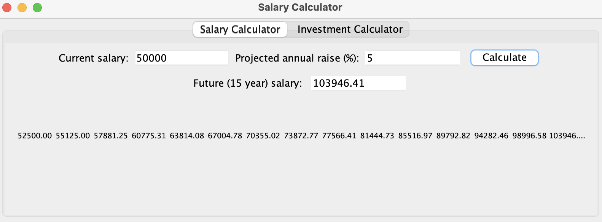
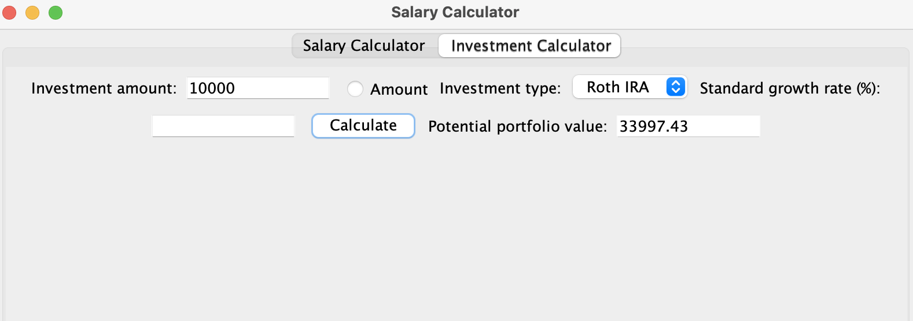

A simple GUI that shows the salary and investment portfolio amount, that you could have, in 15 years. GUI uses Java Swing and users can input their salary, expected growth rate, and investment amount.  

Here are pictures of each GUI page:

Salary Calculator: 

Investment Calculator:

